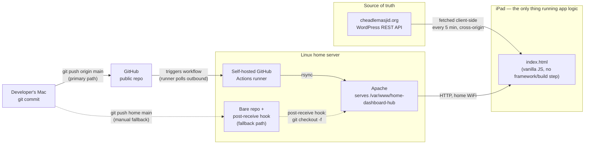
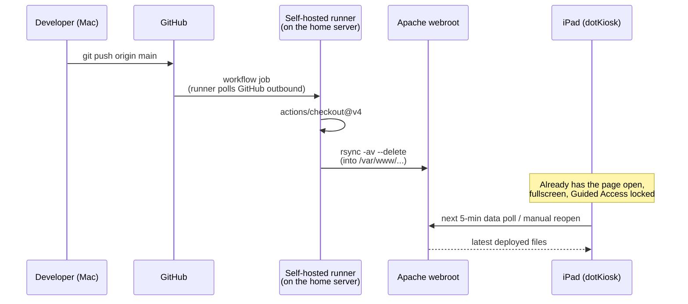

# Architecture — How This Works

This document explains the system at a level above the code: what it
does, how the pieces fit together, and — more importantly for anyone
evaluating this as engineering work rather than just a finished app —
*why* it's built this way, including the mistakes made and fixed along
the way. For the granular commit-by-commit history, see
[CHANGELOG.md](CHANGELOG.md). For setup instructions, see
[README.md](README.md).

## What it does

An iPad mounted around the house (picture-frame case, permanent power)
shows one of several full-screen **displays**, picked from a home
screen. Three exist today: **Prayer Times**, the first one built —
Cheadle Masjid's daily prayer times, counting down live to the next
prayer's Begins time, and optionally sounding the adhan through the
tablet's speaker at that moment; **Server Health**, live stats for the
home server itself; and **Bin Day**, Stockport Council's bin collection
schedule computed entirely from a hardcoded recurring rule, with no
live data source at all (see "Data flow: Bin Day" below for why). The
home screen itself also shows a small **5-day weather strip** (see
"Data flow: Weather" below), the only piece of live data shown outside
a full display. More are planned (utility usage and others — see
"Where this could go next" at the bottom); the app is deliberately
structured so adding one means adding a new screen and a new
home-screen tile, not rebuilding anything that already works. All of it
runs unattended, indefinitely, updated by pushing code from a laptop.

### Multi-display navigation

Every display, plus the home screen that picks between them, lives in
the *same* `index.html` document — switching is a JS show/hide of a
`<div>`, never a real page navigation. This is a hard requirement, not
a style choice: the Prayer Times display depends on a one-time "audio
autoplay unlock" (see the adhan section below) that a page reload would
throw away, so nothing in this app is allowed to reload the page just
to change what's on screen. `showScreen(name)` in `index.html` is the
single place that shows one screen and hides the rest; adding a new
display means adding a new branch there plus a new tile in `#homeScreen`
— it does not touch how any existing display works.

One small **⋮ icon** floats outside the currently-open display's own
panel, opening a menu with **Home** (always returns to the picker) and
**Settings** (Appearance is always shown, since dark mode is app-wide;
a display's own settings, like Prayer Times' Adhan section, are shown
only while that display is open). The icon is also shown **on the home
screen itself** (30 Aug 2026) — Appearance shouldn't require opening a
tablet display first just to reach it — where it centers against the
home screen's own title instead of a `.screenHeader`, and its "Home"
row hides itself there, since navigating Home from Home is meaningless.
Reopening the app after it's been closed (e.g. an iPad restart)
returns straight to whichever display was last open, not the home
screen, so the always-on kiosk behaviour this app was already tuned for
isn't disturbed by having a picker at all.

## System overview



There is **no backend written for this project at all**. The "server" is
just a static file host; all logic — fetching prayer times, computing the
countdown, deciding when to play the adhan, remembering settings — runs
in the browser on the iPad. This was a deliberate simplicity choice: a
static site is far easier to reason about, deploy, and debug than
introducing a server-side component that would need its own hosting,
process management, and failure modes, for a problem that doesn't need
one.

## Data flow: Prayer Times

1. On load, the page reads any cached prayer-time data from
   `localStorage` and renders immediately (so a slow or failed network
   request never means a blank screen).
2. It then makes a cross-origin `XMLHttpRequest` straight to the
   masjid's own WordPress site, which exposes a small custom REST
   endpoint (`/wp-json/dpt/v1/prayertime`) returning today's, tomorrow's,
   and Friday's times as JSON. This repeats every 5 minutes.
3. Every successful response overwrites the `localStorage` cache. A
   failed request doesn't clear the display — it just shows an "Offline
   · showing last update HH:MM" notice and keeps using the last good
   data.
4. A `setInterval` tick, once a second, recomputes: which row is "next",
   the countdown digits, and whether any enabled prayer's adhan should
   fire right now — all derived fresh from the current data + current
   time, nothing is pre-scheduled with timers set in advance. This means
   the display self-corrects if the tablet's clock drifts or the tab
   was backgrounded and resumed; it never gets into a stale state that
   needs a reload to fix.

No prayer time is ever hand-entered or hardcoded — the masjid's own site
remains the single source of truth, which matters for correctness around
things like Ramadan, DST changes, and one-off Iqamah adjustments.

**Open question, not a technical one**: this endpoint being technically
open and unauthenticated doesn't mean fetching and reproducing it here
is authorized under the masjid's own published terms — see
CHANGELOG.md's "Known risks" entry for what was actually found and why
this hasn't been resolved yet.

## Data flow: Server Health

A different shape of problem: Prayer Times reads from an API that
already exists (the masjid's own site); Server Health needs data about
a machine that has no API at all — the home server itself. Rather than
standing up a real web service just to answer "how's the server doing",
the data flow stays a static file, same as everything else in this
app, with a small script doing the work in the background:

```
[server-stats.timer, systemd] --every 10s--> [scripts/server-stats.sh]
                                                        |
                                                        v
                                    [server-stats.json in the webroot]
                                                        |
                                                        v (Apache, same-origin)
                                          [Server Health tablet screen]
```

1. `server-stats.timer` (systemd) fires `server-stats.service` every 10
   seconds — a **oneshot** unit, not a long-running daemon: it runs
   once, does its work, exits, and the timer fires it again later. This
   is the same "static file, not a live backend" philosophy as the rest
   of the app, just applied to locally-generated data instead of a
   remote API.
2. `scripts/server-stats.sh` reads `/proc`, `df`, `ip route`,
   `systemctl`, `lm-sensors`, `apt`, and (if usable) `docker ps`,
   assembles the result with `jq`, and writes it to `server-stats.json`
   in the webroot — the same folder `index.html` lives in, so the
   client's fetch is same-origin (no CORS question at all, unlike the
   masjid API).
3. The script also keeps a short rolling history (last ~24 samples) of
   CPU load/usage, memory %, temperature, and network throughput in a
   dotfile in its own home directory, persisted between runs, purely so
   the client can draw trend sparklines rather than just a single
   current-value snapshot. A *separate* single-sample state file
   persists the previous `/proc/stat` and `/proc/net/dev` readings
   specifically — CPU usage % and network throughput are only
   meaningful as a delta between two points in time, since both sources
   are cumulative counters, not instantaneous values; the very first
   run after install (or after that file is ever deleted) has nothing
   to diff against, so those two fields come back `null` for exactly
   one run and are correct from the second run onward.
4. The client polls `server-stats.json` every 10 seconds (much faster
   than Prayer Times' 5-minute API poll — freshness matters a lot more
   for a live health display than for prayer times that only change
   once a day), with the same resilience pattern: fall back to the last
   good response in `localStorage` on a failed fetch, never blank the
   screen. A `generated_at` timestamp older than 30 seconds — meaning
   the timer itself has stopped firing, not just a single failed
   `fetch` — triggers a "stale data" banner, the same idea as Prayer
   Times' "Offline" notice but catching a different failure mode.
5. `scripts/server-stats.sh` itself is tracked in the repo and deploys
   like any other file (`git push` → rsync into the webroot). The two
   systemd unit files can't work that way — systemd only reads units
   from `/etc/systemd/system/` — so they need a one-time manual install
   (see README.md), the one piece of this feature that isn't
   "just push and it updates."
6. The GitHub Actions deploy workflow writes a timestamp to
   `.last-successful-deploy` in the webroot right after a successful
   sync, which the collector script reads and the display shows as
   "Last Successful Deploy" — deliberately **not** the same thing as
   "is the runner process active." The 29 Aug 2026 DNS outage (below)
   is exactly why that distinction exists: the runner sat
   `active (running)` the entire time it couldn't actually deploy
   anything, which a naive process check would never have caught.

## Data flow: Bin Day

A third shape of problem, different again from the other two: the data
doesn't come from an existing API (Prayer Times) or from the machine
this app already controls (Server Health) — it comes from a council
website with no public API, gated behind a session-based lookup form.
The pragmatic answer here wasn't to build a scraper; it was to notice
that the underlying real-world data is a fixed, low-frequency recurring
pattern, so there's no data flow at all in the usual sense:

```
[BIN_ROTATION constant, index.html] --date math, every tick--> [Bin Day tablet screen]
```

1. The recurring rule — a bin collected every Monday, plus a 4-week
   rotation of extra bins — was derived once, manually, by checking
   Stockport Council's own published calendar for the relevant
   collection round against real dates, then hardcoded as a small
   JS constant (`BIN_ROTATION`, anchored to a known reference Monday).
   See CHANGELOG.md's "Bin Day display" baseline entry for the exact
   rule and how thoroughly it was cross-checked before being trusted.
2. `computeBinSchedule()` derives the next several Mondays from
   whatever `now` the browser's clock reports and runs each one through
   the rotation math — the same "derive it live from the current time,
   never pre-schedule anything in advance" principle already used for
   Prayer Times' countdown and adhan-firing logic, just applied to a
   much lower-frequency event.
3. There is no fetch, no polling interval, no cache, and no
   `localStorage` fallback for this display at all — there's nothing
   to go stale or fail to load, since nothing is ever requested over
   the network in the first place. This is the simplest of the three
   displays specifically because the underlying real-world problem
   (a fixed recurring schedule) doesn't actually require anything more.
4. The trade-off, made explicitly rather than accidentally: if
   Stockport ever changes the collection round's schedule, this app has
   no way to detect that — the hardcoded rule needs a human to notice
   collections stopped matching reality and re-derive it from an
   updated council calendar. Given how infrequently these schedules
   change in practice, this was judged a better trade than building and
   maintaining a scraper against a form with no stable public contract.
5. Stockport publishes this data under the **Open Government Licence**
   (checked directly on their own `/terms-and-conditions` page) — a
   meaningfully clearer legal footing than the still-unresolved Prayer
   Times data-usage question above, and part of why this display was
   comfortable to hardcode and ship without further discussion.

## Data flow: Weather

Smaller in scope than the three full displays — a 5-day forecast strip
in the corner of the home screen — but its own small data flow worth
documenting, since it's a genuine trade-off between two constraints
this app doesn't usually have to balance against each other: needing a
real location to forecast for, while being a fully public GitHub repo
with no backend to hide that location behind.

1. `index.html` fetches directly from **Open-Meteo**
   (`api.open-meteo.com/v1/forecast`) — free, keyless, no signup, same
   "no backend, fetch straight from the browser" shape as the Prayer
   Times API call. Polled every 30 minutes; a failed fetch falls back to
   the last good response cached in `localStorage`, same resilience
   pattern used everywhere else in this app.
2. **The location baked into the source is deliberately not the real
   address this was set up for.** Everything else in this app that
   needs a real-world location (Bin Day's council round) only ever
   commits the *result* of using an address, never the address itself.
   Weather can't quite do that — the forecast API needs actual
   coordinates at request time, every time, so *some* location has to
   live in the public source. The resolution: geocode once (querying
   only the postcode, not the full street address, for a smaller
   footprint than even that lookup needed), then round the result to 2
   decimal places (~1km precision) before writing it into `index.html`.
   Weather forecasting doesn't resolve to house-level precision in the
   first place, so nothing about the forecast's accuracy is lost — only
   the exact address is what's kept out of a public repo.
3. Open-Meteo's `weathercode` field returns one of ~28 WMO weather
   codes; `weatherCategoryForCode()` collapses these down to 7 icon
   categories the widget actually draws (clear, partly-cloudy, cloudy,
   fog, rain, snow, thunderstorm) — deliberately coarser than the full
   WMO table, since a 22px icon can't (and doesn't need to) distinguish
   "light drizzle" from "heavy rain."
4. The icons themselves are a deliberate, noted exception to this app's
   usual monochrome `fill="currentColor"` icon convention — full colour
   (yellow sun, grey cloud, blue rain), because colour is what makes an
   icon this small legible as "which condition" at a glance, the same
   reason every real weather app does this. Animated via slow CSS
   `@keyframes`, not JS, kept deliberately subtle for an always-on wall
   display — same reasoning as the mesh-gradient background's own slow
   drift, and disabled together under the same `prefers-reduced-motion`
   query.

## Deployment architecture

The interesting engineering here isn't the frontend — it's the
deployment pipeline, because it had to satisfy a constraint that's easy
to state and annoying to actually build: **"pushing code from my laptop
should update a tablet in someone's living room, without that tablet
ever needing to run anything more than a browser."**



The deploy target is a home server with **no public IP address** — a
GitHub-hosted cloud runner has no route to it at all. The fix is a
**self-hosted runner**: GitHub's own runner agent, installed as a
systemd service directly on the home server, which continuously polls
GitHub asking "any jobs for me?" over a normal outbound connection —
the same direction as a browser making a request. Nothing on the home
network has to accept an inbound connection from the internet, which
matters because this server also hosts another, unrelated production
site. The alternative (a cloud runner + SSH into a port forwarded on
the home router) would have worked too, but would have meant exposing
SSH on that box to the entire internet just to run this project's
deploys.

A manual fallback still exists underneath this: the original bare git
repo + `post-receive` hook (`git push home main`), kept specifically so
there's a way to deploy if the runner service is ever down. Both paths
write to the exact same folder, so neither knows or cares that the
other exists.

`git push`-triggered deployment is a well-worn pattern regardless of
which of the two mechanisms above executes it (this is essentially a
hand-rolled Heroku/Vercel) — chosen over any third-party PaaS because it
removes any dependency on one, and any need for the tablet or server to
have public internet exposure at all: everything happens over the home
LAN, whether triggered manually or automatically.

## Key engineering problems solved (not just "features built")

A few things here are worth more than the line-count they took, because
the *process* of finding and fixing them is the actual engineering:

- **Two web servers fighting over port 80.** The deploy plan assumed
  nginx; the actual server turned out to already be running Apache for
  an unrelated production site. Rather than blindly starting nginx
  (which would have failed to bind the port) or stopping Apache (which
  would have taken the other site offline), the fix was a dedicated
  Apache vhost bound to the server's specific IP — solving the immediate
  problem without touching something unrelated that depended on the same
  box. This is a "read the actual system state before changing it"
  lesson more than a technical one.
- **iOS Safari's audio autoplay policy.** Browsers block JavaScript from
  playing sound without a prior user gesture. The fix (a page-lifetime
  "unlock" on the very first tap) directly conflicted with an earlier
  design decision to auto-reload the page nightly — a reload would throw
  the unlock away and silently break the adhan. Removing the reload was
  the right call once that interaction was understood, but it only
  became obvious by tracing the actual failure mode, not by guessing.
- **Removing a copyrighted file from git history, not just from the
  latest commit.** Before making the repo public, the bundled adhan
  recording needed to disappear entirely — a plain `git rm` would have
  left it recoverable from every prior commit. This needed rewriting
  history (`git filter-branch`) and understanding that git commit hashes
  are content-addressed, so changing history means *every* downstream
  commit gets a new hash — which is also why the already-deployed server
  remote needed a one-time force-push afterwards to resync.
- **A subtle CSS animation bug.** An early version of the countdown used
  an analogue clock face whose hands were driven by `% 60`/`% 3600`
  modulo arithmetic. That looked correct in isolation but caused the
  hands to visibly spin almost a full circle backwards once a minute,
  because a CSS transition animates between two raw numbers, not the
  visually shortest path between two angles. The fix — feeding the
  animation a continuously-decreasing, never-wrapped number — is a small
  example of the gap between "the maths is correct" and "the maths
  produces the intended animation."
- **GitHub silently rejecting password auth.** Not a bug in this
  project's code, but a real "why doesn't this work" moment: GitHub
  stopped accepting account passwords for git operations over HTTPS in
  2021 (unrelated to 2FA), which isn't obvious from the error message
  alone. Fixed by switching to SSH key auth rather than fighting with
  Personal Access Tokens.
- **Reaching a private server from a cloud CI system.** GitHub Actions'
  default runners execute in GitHub's cloud, which has no route to a
  server behind a home router with no public IP. Rather than solving
  this by exposing the server to the internet (port-forwarding SSH,
  dynamic DNS), a self-hosted runner flips who initiates the connection:
  the server polls GitHub outbound instead of GitHub reaching in. Same
  outcome, opposite — and safer — direction of trust.
- **A limitation no amount of CSS could fix.** Hiding iOS's system
  status bar (clock/battery/WiFi icons) turned out to be impossible from
  a web page at all — `apple-mobile-web-app-status-bar-style` only
  changes how content flows *around* the status bar, it can't remove it,
  because only native apps are permitted to request that via
  `prefersStatusBarHidden`. Building a native wrapper was one option
  (blocked here on only having Xcode's Command Line Tools installed, not
  full Xcode); the pragmatic fix was a small, genuinely free, purpose-
  built native app (dotKiosk) that does exactly that one thing. Knowing
  when a problem is a platform boundary rather than a bug to keep
  debugging is its own skill.
- **A "healthy" service that couldn't actually do anything.** Two
  deploys once sat stuck in GitHub's queue for over an hour with no
  error visible anywhere in the repo or workflow. `systemctl status` on
  the runner showed it `active (running)` the whole time — the process
  itself was fine, which made this misleading rather than a normal
  "service crashed" bug. The real fault was one layer down: the log
  showed `Name or service not known` against GitHub's own hostnames —
  DNS, not the runner. Tracing it further with `resolvectl status`
  showed *why*: the server's active network interface (`wlp2s0`) had no
  DNS server assigned at all — the only interface with one configured
  was Tailscale's, and it deliberately isn't the default route for
  non-Tailscale domains (`-DefaultRoute` in `resolvectl status`), so it
  correctly refused to resolve a public GitHub hostname. `enp0s25`
  turned out to be a red herring at first — it *looked* like the
  server's wired interface, but `ip route get` showed it was actually
  `DOWN` and unused, so setting DNS there did nothing until `ip route`
  identified `wlp2s0` as the interface actually carrying traffic. Fixed
  live with `resolvectl dns wlp2s0 1.1.1.1 8.8.8.8` +
  `resolvectl domain wlp2s0 '~.'`, confirmed via `resolvectl query`
  before touching the runner at all, then a runner restart cleared the
  backlog in seconds. That live fix was deliberately session-only at
  the time — nobody had yet confirmed whether `wlp2s0` never having DNS
  was intentional or itself the underlying gap, so a persistent config
  change wasn't written on a guess. **Root-caused and made permanent the
  same day** (see the dated entry below): `wlp2s0` is managed by
  NetworkManager (not netplan — its wifi config file is empty,
  `wifis: {}`; the WiFi connection profile lives entirely inside
  NetworkManager itself), and `/etc/NetworkManager/NetworkManager.conf`
  had no explicit `dns=` setting, leaving DNS registration into
  `systemd-resolved` to an implicit default that could apparently drop
  silently (a reconnect, a sleep/wake — never conclusively pinned down).
  Fixed with two changes, not one: `dns=systemd-resolved` made explicit
  in `NetworkManager.conf` (the likely actual fix), plus
  `FallbackDNS=1.1.1.1 8.8.8.8` added to `resolved.conf` — which had none
  configured at all — as a safety net regardless of cause, the same
  "fix the likely cause, add a safety net anyway" approach used
  elsewhere in this project (see the Server Health grid overflow fix).
  The general lesson: "the service is running" and "the service can do
  its job" are different claims, and confirming which layer actually
  failed (process vs. name resolution vs. network reachability) before
  touching anything avoids fixing the wrong thing.

## Frontend implementation notes

- Single HTML file, plain ES5 JavaScript — no framework, no build step,
  no `npm install`. This was originally a hard requirement (an ancient
  2013 Android tablet's browser couldn't run modern JS at all) and was
  kept even after the target device changed to a modern iPad, since
  rewriting working code for style rather than function is its own kind
  of technical debt.
- State lives in a handful of module-scoped variables inside a single
  IIFE (`(function () { ... })()`), plus `localStorage` for anything that
  needs to survive a reload (theme choice, adhan on/off settings, cached
  prayer data, "already played today" tracking). There's no state
  management library because the state is small and simple enough that
  one would add complexity rather than remove it.
- Settings (dark mode, per-prayer adhan toggles) are all just CSS class
  toggles on DOM elements, persisted to `localStorage` and re-applied on
  load — the simplest possible approach for a UI this size.

## Skills this project involved

For anyone reading this to evaluate the work rather than use the app:
live production debugging on a real shared server (not a clean VM);
reasoning about browser security models (CORS, autoplay policy) and
designing around them instead of fighting them; git internals beyond
day-to-day commit/push (history rewriting, remote divergence, why
content-addressing means changing history reshapes everything after it);
Linux system administration (systemd services and timers, Apache
virtual hosting, file permissions, SSH key management); diagnosing a
live network/DNS fault down to the actual root cause (distinguishing a
process being "active" from a service actually working, tracing a
resolution failure through `systemd-resolved`/`NetworkManager`
interaction rather than stopping at the first plausible-looking fix,
and verifying a config change survives a real reboot instead of trusting
it); making a deliberate build-vs-avoid-complexity call (no backend, no
framework, no build step) and being able to justify it; designing a
navigation/state structure (the home screen + `showScreen()` pattern)
that lets new, unrelated features (future displays) get added without
touching existing ones, while working around a real platform constraint
(iOS's audio-unlock requirement ruling out page reloads as a navigation
mechanism); and writing documentation aimed at someone other than
yourself, which this file is itself an example of.

## Future displays under consideration (not commitments)

Ideas for what to build into `#homeScreen` next, roughly in order of how
little new infrastructure each one needs (Server Health and Bin Day
have already shipped and are fully live — see their own "Data flow"
sections above):

- **Electricity / gas usage** — via a UK smart meter data source (e.g.
  Hildebrand Glow or n3rgy). User is on Scottish Power, prepayment
  plan — worth confirming what data a prepayment smart meter actually
  exposes (some data sources assume credit-plan billing) before
  committing design time. If a dynamic tariff ever becomes relevant, a
  "current rate + cheapest window tonight" view would be genuinely
  useful, not just decorative.
- **Water usage** — depends on whether the local supplier exposes any
  API/export at all; worth checking before committing design time to
  the display itself.
- **Ambient/screensaver mode** — a photo-frame idle state (family
  photos + a small clock) any display could fall back to after
  inactivity, distinct from the "pick a display" home screen — suits
  the picture-frame form factor directly.

## Other engineering ideas (learning-oriented, not commitments)

- Have the workflow run a quick check (e.g. that `index.html` is valid
  and the JS parses) *before* the rsync step, so a broken push never
  reaches the live display — introduces the "CI" half of CI/CD, not just
  the "CD" half already built.
- Add a minimal backend (even a 20-line one) to move the prayer-time
  fetch server-side, removing the cross-origin dependency at request
  time and opening the door to caching, rate-limit protection, or
  serving multiple masjids from one instance.
- Containerize the deployment (Docker + Apache or nginx) for a
  reproducible server setup instead of hand-configured system packages.
- Add automated tests around the pure logic (time parsing, next-prayer
  selection, countdown math) — currently verified by hand in a browser
  each time, which doesn't scale as more features are added.
- Basic uptime/health monitoring for the home server + display, since
  right now there's no alert if the display silently goes offline.
  (Server Health's own "Last Successful Deploy" card is a step in this
  direction, but doesn't alert anyone — it just shows the number.)
- **Remote reboot button on the Server Health display — discussed and
  deliberately deferred (30 Aug 2026), not forgotten.** Technically
  possible, but it would be the first *mutating/privileged* action this
  app has ever triggered — everything else here is read-only content
  or a periodically-written data file. Recommended against building it
  as a plain button because: the iPad sits in a shared space where a
  stray tap (kid, guest, pet) could trigger it, with a client-side
  confirm dialog protecting nothing real since anyone who can view the
  page source can hit the underlying endpoint directly; the server also
  runs other services (Nextcloud) that a reboot takes down too, not
  just this display; and the actual need (restarting after a pending
  update, already visible via the existing "reboot required" flag) is
  rare and trivial to do over SSH already. If this gets revisited, it
  needs real safeguards, not just a UI convenience: a POST-only
  endpoint gated behind its own auth (separate from the app's own
  access), a hold-to-confirm or type-to-confirm gesture on-device
  rather than a single tap, a `sudoers` entry scoped to *only* the
  reboot command via a wrapper script (never blanket passwordless
  sudo), and a log of every trigger. Don't build the plain version of
  this without re-raising these risks with the user first.
