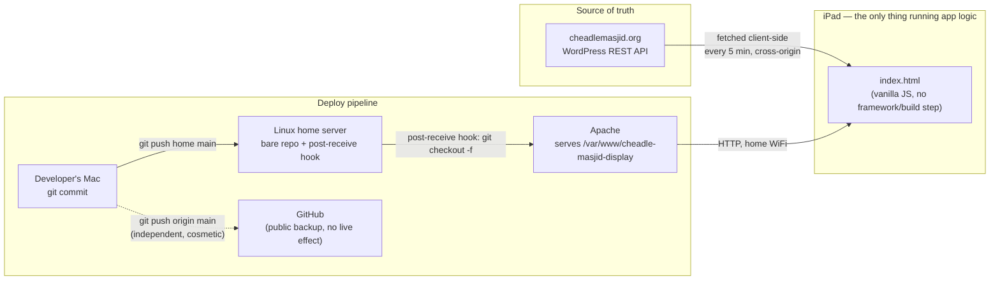
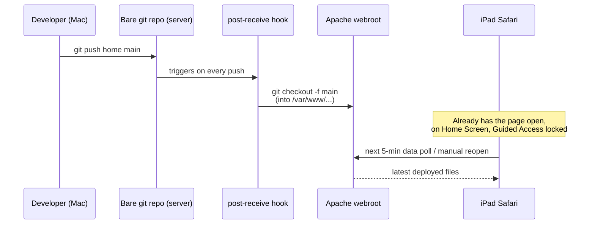

# Architecture — How This Works

This document explains the system at a level above the code: what it
does, how the pieces fit together, and — more importantly for anyone
evaluating this as engineering work rather than just a finished app —
*why* it's built this way, including the mistakes made and fixed along
the way. For the granular commit-by-commit history, see
[CHANGELOG.md](CHANGELOG.md). For setup instructions, see
[README.md](README.md).

## What it does

A tablet mounted in a living room shows Cheadle Masjid's daily prayer
times, counts down live to the next Iqamah, and optionally sounds the
adhan through the tablet's speaker at the right moment — unattended,
indefinitely, updated by pushing code from a laptop.

## System overview

There is **no backend written for this project at all**. The "server" is
just a static file host; all logic — fetching prayer times, computing the
countdown, deciding when to play the adhan, remembering settings — runs
in the browser on the iPad. This was a deliberate simplicity choice: a
static site is far easier to reason about, deploy, and debug than
introducing a server-side component that would need its own hosting,
process management, and failure modes, for a problem that doesn't need
one.

## Data flow

1. On load, the page reads any cached prayer-time data from
   `localStorage` and renders immediately (so a slow or failed network
   request never means a blank screen).
2. It then makes a cross-origin `XMLHttpRequest` straight to the
   masjid's own WordPress site, which exposes a small custom REST
   endpoint (`/wp-json/dpt/v1/prayertime`) returning today's, tomorrow's,
   and Friday's times as JSON. This repeats every 5 minutes.
3. Every successful response overwrites the `localStorage` cache. A
   failed request doesn't clear the display — it just shows an "Offline
   · showing last update HH:MM" notice and keeps using the last good
   data.
4. A `setInterval` tick, once a second, recomputes: which row is "next",
   the countdown digits, and whether any enabled prayer's adhan should
   fire right now — all derived fresh from the current data + current
   time, nothing is pre-scheduled with timers set in advance. This means
   the display self-corrects if the tablet's clock drifts or the tab
   was backgrounded and resumed; it never gets into a stale state that
   needs a reload to fix.

No prayer time is ever hand-entered or hardcoded — the masjid's own site
remains the single source of truth, which matters for correctness around
things like Ramadan, DST changes, and one-off Iqamah adjustments.

## Deployment architecture

The interesting engineering here isn't the frontend — it's the
deployment pipeline, because it had to satisfy a constraint that's easy
to state and annoying to actually build: **"pushing code from my laptop
should update a tablet in someone's living room, without that tablet
ever needing to run anything more than a browser."**

`git push` as a deploy mechanism is a well-worn pattern (this is
essentially a hand-rolled Heroku/Vercel), chosen over GitHub Pages once
a home server became available, because it removes any dependency on a
third party and any need for the tablet or server to have public
internet exposure at all — everything happens over the home LAN.

## Key engineering problems solved (not just "features built")

A few things here are worth more than the line-count they took, because
the *process* of finding and fixing them is the actual engineering:

- **Two web servers fighting over port 80.** The deploy plan assumed
  nginx; the actual server turned out to already be running Apache for
  an unrelated production site. Rather than blindly starting nginx
  (which would have failed to bind the port) or stopping Apache (which
  would have taken the other site offline), the fix was a dedicated
  Apache vhost bound to the server's specific IP — solving the immediate
  problem without touching something unrelated that depended on the same
  box. This is a "read the actual system state before changing it"
  lesson more than a technical one.
- **iOS Safari's audio autoplay policy.** Browsers block JavaScript from
  playing sound without a prior user gesture. The fix (a page-lifetime
  "unlock" on the very first tap) directly conflicted with an earlier
  design decision to auto-reload the page nightly — a reload would throw
  the unlock away and silently break the adhan. Removing the reload was
  the right call once that interaction was understood, but it only
  became obvious by tracing the actual failure mode, not by guessing.
- **Removing a copyrighted file from git history, not just from the
  latest commit.** Before making the repo public, the bundled adhan
  recording needed to disappear entirely — a plain `git rm` would have
  left it recoverable from every prior commit. This needed rewriting
  history (`git filter-branch`) and understanding that git commit hashes
  are content-addressed, so changing history means *every* downstream
  commit gets a new hash — which is also why the already-deployed server
  remote needed a one-time force-push afterwards to resync.
- **A subtle CSS animation bug.** An early version of the countdown used
  an analogue clock face whose hands were driven by `% 60`/`% 3600`
  modulo arithmetic. That looked correct in isolation but caused the
  hands to visibly spin almost a full circle backwards once a minute,
  because a CSS transition animates between two raw numbers, not the
  visually shortest path between two angles. The fix — feeding the
  animation a continuously-decreasing, never-wrapped number — is a small
  example of the gap between "the maths is correct" and "the maths
  produces the intended animation."
- **GitHub silently rejecting password auth.** Not a bug in this
  project's code, but a real "why doesn't this work" moment: GitHub
  stopped accepting account passwords for git operations over HTTPS in
  2021 (unrelated to 2FA), which isn't obvious from the error message
  alone. Fixed by switching to SSH key auth rather than fighting with
  Personal Access Tokens.

## Frontend implementation notes

- Single HTML file, plain ES5 JavaScript — no framework, no build step,
  no `npm install`. This was originally a hard requirement (an ancient
  2013 Android tablet's browser couldn't run modern JS at all) and was
  kept even after the target device changed to a modern iPad, since
  rewriting working code for style rather than function is its own kind
  of technical debt.
- State lives in a handful of module-scoped variables inside a single
  IIFE (`(function () { ... })()`), plus `localStorage` for anything that
  needs to survive a reload (theme choice, adhan on/off settings, cached
  prayer data, "already played today" tracking). There's no state
  management library because the state is small and simple enough that
  one would add complexity rather than remove it.
- Settings (dark mode, per-prayer adhan toggles) are all just CSS class
  toggles on DOM elements, persisted to `localStorage` and re-applied on
  load — the simplest possible approach for a UI this size.

## Skills this project involved

For anyone reading this to evaluate the work rather than use the app:
live production debugging on a real shared server (not a clean VM);
reasoning about browser security models (CORS, autoplay policy) and
designing around them instead of fighting them; git internals beyond
day-to-day commit/push (history rewriting, remote divergence, why
content-addressing means changing history reshapes everything after it);
Linux system administration (systemd services, Apache virtual hosting,
file permissions, SSH key management); making a deliberate
build-vs-avoid-complexity call (no backend, no framework, no build
step) and being able to justify it; and writing documentation aimed at
someone other than yourself, which this file is itself an example of.

## Where this could go next (learning-oriented ideas, not commitments)

- Replace the manual `git push home main` with a GitHub Actions workflow
  that deploys automatically on push to `main` — introduces CI/CD
  concepts (webhooks, secrets management for SSH keys in CI).
- Add a minimal backend (even a 20-line one) to move the prayer-time
  fetch server-side, removing the cross-origin dependency at request
  time and opening the door to caching, rate-limit protection, or
  serving multiple masjids from one instance.
- Containerize the deployment (Docker + Apache or nginx) for a
  reproducible server setup instead of hand-configured system packages.
- Add automated tests around the pure logic (time parsing, next-prayer
  selection, countdown math) — currently verified by hand in a browser
  each time, which doesn't scale as more features are added.
- Basic uptime/health monitoring for the home server + display, since
  right now there's no alert if the display silently goes offline.
